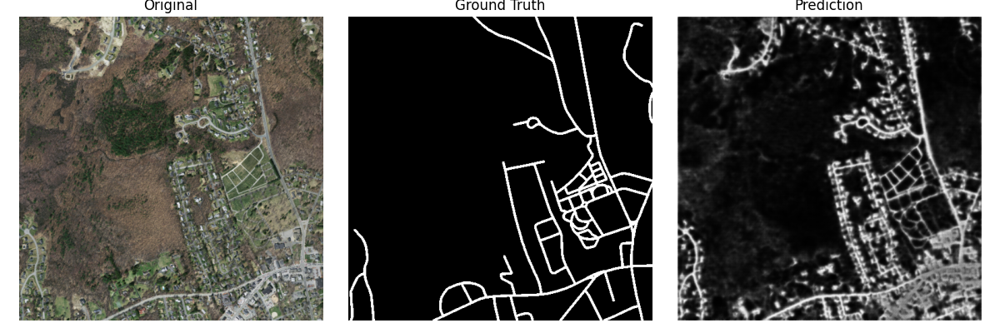

# Road Segmentation and Classification with U-Net

This project performs semantic segmentation of roads using U-Net on the [Massachusetts Roads Dataset](https://www.cs.toronto.edu/~vmnih/data/). It also classifies the detected road type (e.g., highway, main road, street, dirt road).

---

## Dataset

- Training, validation, and test images are preprocessed to 512x512 resolution.
- Masks are binary (road vs background).
- Dataset paths:
  - `tiff/train/`, `tiff/train_labels/`
  - `tiff/val/`, `tiff/val_labels/`
  - `tiff/test/`

---

## Model Architecture

- Model: **U-Net** (encoder-decoder)
- Loss: Binary Cross-Entropy
- Optimizer: Adam
- Metrics: Accuracy

---

## Pipeline

1. **Preprocess dataset**
2. **Build and train U-Net**
3. **Predict road masks**
4. **Visualize results**
5. **Overlay predictions on images**
6. **Classify road type from segmented regions**

---

## Results

Sample predictions are saved in the `sample_predictions/` folder:

| Original | Ground Truth | Prediction |
|----------|--------------|------------|
|  | _..._ | _..._ |

---

## Road Type Classification

Using basic region features (`area`, `eccentricity`, `solidity`, `extent`) with a Random Forest Classifier to predict:
- `Highway`, `Main Road`, `Street`, `Dirt Road`

---

## Model & Export

- Best trained U-Net is saved as:
  - `unet_best_model.keras`
  - `unet_roads.pkl` (for Python loading)
- Sample visualizations are saved as PNGs in `sample_predictions/`

---

## Run Locally

```bash
git clone https://github.com/your-username/Road_Segmentation.git
cd Road_Segmentation
pip install -r requirements.txt
python main.py
